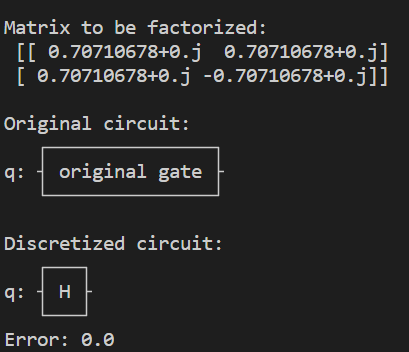

## Decomposition Tools Comparison


### Qiskit Solovay-Kitaev 

**setup:**

```shell
$ pip install qiskit
```

**Input:** 1-qubit unitary gate

**Output:** a circuit consisting of a sequence of one-qubit gates (SGate, HGate, SdgGate, TGate, TdgGate, ZGate, XGate, YGate)

- Example output of a Hadmard gate:



**qule command:** 

`./qule --decomposition qiskit`


### SQUANDER (Sequential Quantum Gate Decomposer)

**github link:** https://github.com/rakytap/sequential-quantum-gate-decomposer

**set-up:** 

- reference: https://codedocs.xyz/rakytap/sequential-quantum-gate-decomposer/

- conda virtual environment is highly recommended

  ```shell
  # Creating new python environment:
  $ conda create -n qgd
  
  # Activate the new anaconda environment
  $ conda activate qgd
  
  # Install required dependencies:
  $ conda install numpy scipy pip pytest scikit-build tbb-devel && conda install -c conda-forge gsl && pip install qiskit matplotlib
  
  # Install squander package
  $ pip install squander
  ```

- go to `\qule\src\Decomposition\squander.py` and change the sys path (line 12) to the location of squander. You can check the location of squander by `pip show squander`

  

**Input:** any n-qubit unitary gate

**Output:** a circuit consisting of a sequence of one-qubit rotations and two-qubit controlled gates (such as controlled NOT or controlled phase gate).

**qule command:** 

`./qule --decomposition SQUANDER`

- Example output of a 3-qubit gate:


### OpenQL

**github link:** https://github.com/QuTech-Delft/OpenQL

**Docs:** 

- https://openql.readthedocs.io/en/latest/old/passes/decomposition.html?highlight=decomposition
- https://repository.tudelft.nl/islandora/object/uuid:9c60d13d-4f42-4d8b-bc23-5de92d7b9600?collection=education

**set-up:** 

```shell
!pip install qutechopenql 
!pip install qiskit
```

**Input:** a quantum gate as a unitary matrix (vector<complex<double>>), no limit in how many qubits it can apply to

**Output:** a circuit consisting of

- `ry` gate
- `rz` gate
- `cnot` gate

**Algorithm:** Quantum Shannon Decomposition (https://arxiv.org/pdf/2101.02993.pdf, p7)

**qule command:** 

`./qule --decomposition OPENQL`

**Example output:**

`./qule --matrix_type rand --n 4 --method GDP --alpha 0.5 --num_tests 2 --decomposition OPENQL`


